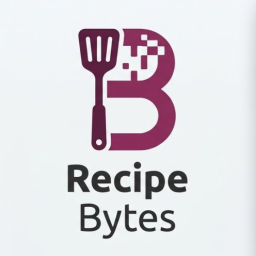

  

**RecipeBytes** is a smart, user-friendly Android application designed to be your personal kitchen companion. Built with modern Android development practices, it helps users explore recipes, plan weekly meals, and suggest dishes based on available ingredients.

---

## � Installation

Get started with RecipeBytes in just a few simple steps:

1. **Download the APK file** i.e RecipeBytesAPK.apk
2. **Enable unknown sources** on your Android device (Settings → Security → Install from unknown sources).
3. **Open the APK file** and tap "Install".
4. **Launch the app** and start planning your meals! 🎉

---

## 🚀 Core Functionalities

- **Comprehensive Recipe Exploration** 🔍: Browse, search, filter (by categories like Breakfast, Lunch, Dinner, Dessert), and sort a diverse collection of recipes.
- **Multi-Step Recipe Addition** 📝: A seamless 4-step wizard to add your own recipes:
  1.  **Basic Info** ℹ️: Title, Description, and Category.
  2.  **Ingredients** 🥗: Dynamic list with quantities.
  3.  **Preparation** 🍳: Sequential numbered steps.
  4.  **Visuals** 📸: Pick an image from the gallery or provide a web URL (with auto-preview).
- **Smart Suggestion Engine** 💡: Enter the ingredients you have on hand, and the app will rank and suggest matching recipes (Best Match, Better Match, etc.).
- **Weekly Meal Planner** 📅: Organize your cooking schedule by assigning recipes to specific days of the week using an intuitive chip-based interface.
- **Interactive Recipe Details** 📖: View full details or enter edit mode to update existing recipes dynamically.
- **Theme Support** 🌓: Toggle between **Light and Dark modes** for comfortable viewing at any time of day.
- **Offline Persistence** 💾: All your recipes and meal plans are saved locally using SharedPreferences and JSON serialization, ensuring your data is always accessible.
- **Connectivity Alerts** 📡: Notifies users when they are offline to manage expectations for web-based image loading.
- **Charging Alerts** 🔋: Uses broadcast receivers to notify users when the device starts charging, encouraging them to explore new recipes.
- **Reboot Persistence** 🔄: Listens for device reboot (`BOOT_COMPLETED`) to restore state and maintain app functionality after a system restart.

---

## 📁 Project Structure

The project follows a modular package structure for clean separation of concerns:

- **`activities/`**: Contains core screens like `MainActivity` (Bottom Nav host), `AddRecipeActivity` (Wizard), and `RecipeViewDetailsScreen`.
- **`fragments/`**: Houses individual feature modules:
  - `HomeFragment`: Dashboard with quick-access cards.
  - `ExploreFragment`: Recipe discovery and management.
  - `PlannerFragment`: Weekly scheduling logic.
  - `SuggestFragment`: Ingredient matching engine.
  - `AddRecipeFragment(1-4)`: Steps for the recipe creation wizard.
- **`models/`**: Data classes (`Recipe`, `Ingredient`, `Step`, `MealDay`) and Repository objects for data persistence.
- **`adapters/`**: RecyclerView adapters for handling dynamic lists (`RecipeAdapter`, `IngredientAdapter`, `StepsAdapter`, `MealDayAdapter`, `SuggestResultAdapter`).
- **`receivers/`**: System broadcast handlers for background alerts:
  - `BootReceiver`: Restores notifications and state after the device finishes booting.
  - `PowerReceiver`: Notifies users when a power source is connected (`ACTION_POWER_CONNECTED`).
  - `MealReminderReceiver`: Manages scheduled notifications for the meal planner.
- **`res/layout/`**: Optimized XML layouts with clear documentation and responsive design.

---

## 🛠 Specifications & Tech Stack

- **Language** ⌨️: [Kotlin](https://kotlinlang.org/) (Modern, concise, and safe).
- **IDE** 💻: [Android Studio](https://developer.android.com/studio) 
- **Minimum SDK** 📱: 24 (Android 7.0 Nougat).
- **Target SDK** 🎯: 36 (Android 15+ compatible).
- **UI Components** 💎: [Material Design](https://m3.material.io/) for a modern look and feel.
- **Libraries** 📦:
  - **Glide**: High-performance image loading and caching.
  - **Gson**: Seamless JSON serialization for data storage.
  - **Navigation Component**: Smooth transitions between fragments.
  - **CardView & RecyclerView**: For efficient and beautiful list displays.

---

## 👨‍💻 Developed By

**RecipeBytes Team**
- **Hania Arshad**  &  **Maryyam Fakhar**

*Passionate about making mobile apps that simplify your daily life.*

---

*Enjoy your cooking journey with RecipeBytes!* 🍳📖
